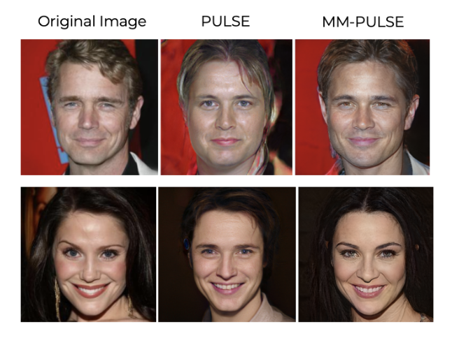
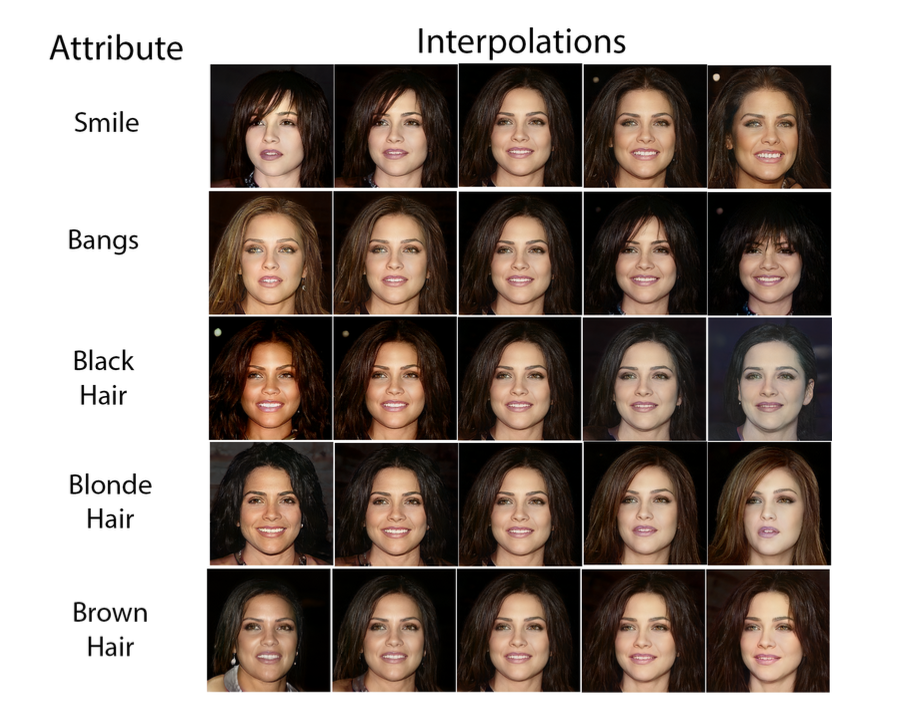
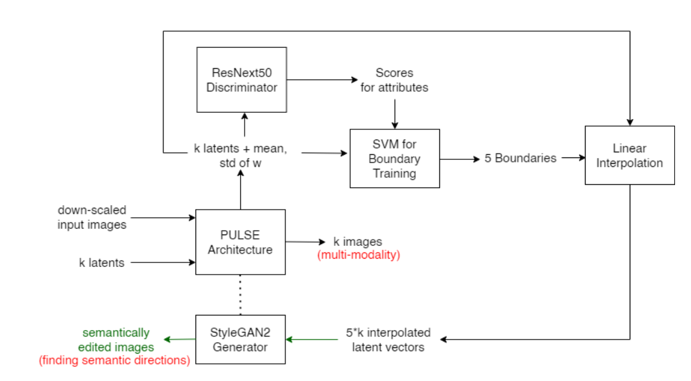

# MM-PULSE: Multi-modal Photo Upsampling via Latent Space & Exploration of StyleGAN2

[Paper](mm-pulse.pdf)

PULSE (Photo Upsampling via Latent Space Exploration) produces high-resolution images with high accuracy; however, it outputs only one image. MM-PULSE aims to address and solve the limitations of PULSE by first integrating StyleGAN2 into the PULSE architecture, enhancing the quality of generated images and then using different random latents achieving multi-modality. Additionally, it employs an InterFaceGAN-based approach to determine semantic directions for attributes like ’smile’, ’bangs’ and ’hair color’ and utilizes them to perform targeted edits on the generated images.

To simplify, MM-PULSE performs two main tasks: it takes a low-resolution input image and generates multiple high-resolution images that are visually realistic and properly downscaled, while also enabling the editing of specific attributes in images by manipulating the latent space.

    

---

### Architecture

---

Built on top of [PULSE](https://github.com/adamian98/pulse), [InterfaceGAN](https://github.com/genforce/interfacegan)
